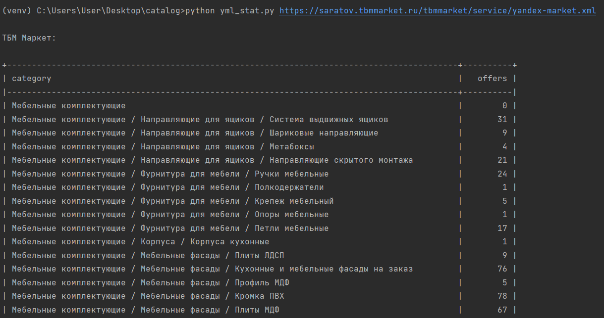
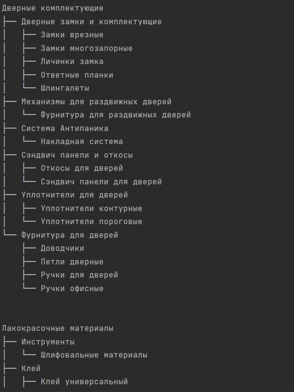

# Yandex Catalog Report
Script `yml_stat.py` gets a link to the Yandex Market catalog which give response in [Yandex Market Language (YML)](https://yandex.com/support/partnermarket/export/yml.html) format. 
Then it constructs tree of categories as string in the form -
( {level_1} / {level_2} / ... ). As a result it produces a report in the form of a table with number of offers for every 
category.

## Get project
Run these commands in terminal in this order:
```commandline
git clone https://github.com/AbshenovS/yandex_market_catalog.git
cd yandex_market_catalog
python3 -m venv venv
source ./venv/bin/activate
pip3 install -r ./requirements.txt
```
To run script:
```commandline
python3 yml_stat.py url_of_yandex_market_catalog
```
Or you can just run `python3 yml_stat.py` and enter url <br />
Example feeds: <br />
[https://nnetwork.ru/yandex-market.xml](https://nnetwork.ru/yandex-market.xml) <br />
[https://saratov.tbmmarket.ru/tbmmarket/service/yandex-market.xml](https://saratov.tbmmarket.ru/tbmmarket/service/yandex-market.xml) <br />
Also you can run command `python3 yml_stat.py example` to run script on the examples above. <br />
Moreover, there is option to run it with docker-compose. After you cloned repo cd to the folder and:
```
export yml_url=your_yml_url
docker-compose up
```

## Results

<br />
Also you can print the tree structures of categories:<br />
